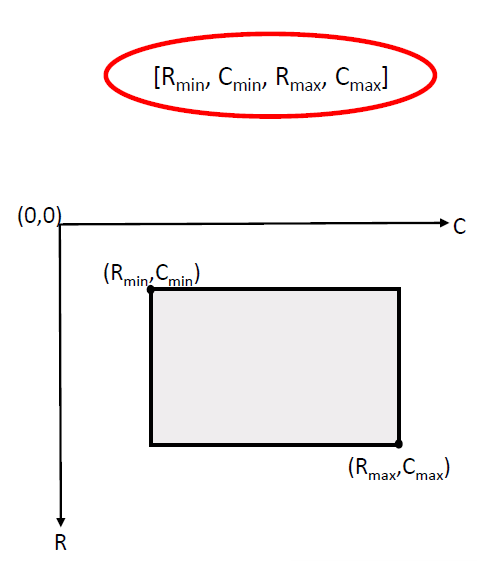

# Spark Object Detection

A deep learning pipeline for Space Situational Awareness (SSA), to detect and classify space objects in orbit. 
Object detection and classification is critical for SSA, as it ensures the safety and the success of space missions.

# Test & Training Data

# Model Predictions

## Model Performance - Results and Achievements

### Average Precision (AP)
- Overall Improvement: AP (all50-95) increased from 0.474 to 0.761 over 20 epochs.
- AP at Different IoU Thresholds:
  - AP (all50): 0.965
  - AP (all75): 0.871
- Object Size Performance:
  - Small Objects: Not detected (AP: -1.0)
  - Medium Objects: Improved from 0.312 to 0.654
  - Large Objects: Improved from 0.487 to 0.779

### Average Recall (AR)
- Overall Improvement: AR (all50-95) increased from 0.628 to 0.808.
- Object Size Performance:
  - Small Objects: Not detected (AR: -1.0)
  - Medium Objects: Improved from 0.572 to 0.674
  - Large Objects: Improved from 0.643 to 0.773

### Key Achievements
- Significant improvement in AP and AR across training epochs.
- High detection accuracy for medium and large objects.
- Clear identification of model limitations (small objects).

Figures demonstrating the AP and AR trends over 20 epochs are included in the repository.

### Why the Model Struggles with Small Objects

The pre-trained Faster R-CNN V2 model, used in this project, exhibits poor performance in detecting small objects. This issue can be attributed to two primary factors:

#### 1. COCO Dataset Object Size Distribution
The model is pre-trained on the COCO dataset, where objects are categorized by size:
- Small: area < 32² pixels
- Medium: 32² ≤ area < 96² pixels
- Large: area ≥ 96² pixels

Approximately 81.93% of the objects in the COCO dataset are medium to large-sized, leaving a relatively small proportion of small objects for the model to learn from. This imbalance leads to a model that is inherently biased towards detecting medium and large objects.

#### 2. Architectural Constraints of Faster R-CNN V2
Faster R-CNN's architecture, with its Region Proposal Network (RPN) and feature extraction backbone, is optimized for detecting objects that occupy a significant portion of the image. Small objects, which occupy fewer pixels, may not be adequately represented in the feature maps, leading to lower detection accuracy.

### Potential Improvements
To enhance the model's ability to detect small objects:
- Increase the proportion of small objects in the training dataset through data augmentation.
- Use a model architecture specifically optimized for small object detection, such as Cascade R-CNN or EfficientDet.
- Adjust the anchor box sizes in the Region Proposal Network to better match the expected object sizes.

# Usage Instructions

This repository contains all you need to start playing around with the SPARK Dataset.

## Stream 1: spacecraft detection

Please first create a `data/` folder in `stream-1/`, then download the training and validation datasets in the newly created folder (see dedicated email for download link). After unziping the `*.zip` archives, the tree structure of `data/` must finally follow the one below:

<pre>
└───stream-1/
    ├───data/  
        ├───train/
        ├───val/
        ├───train.csv
        ├───val.csv
</pre>

The `stream-1/visualize_data.ipynb` notebook contains basic functions to load and display dataset samples.

The correspondences between class names and indexes are given below.

| Class                     | Name                      | Index    |
|---------------------------|---------------------------|----------|
| Proba 2                   | `proba_2`                 | 0        |
| Cheops                    | `cheops`                  | 1        |
| Debris                    | `debris`                  | 2        |
| Double star               | `double_star`             | 3        |
| Earth Observation Sat 1   | `earth_observation_sat_1` | 4        |
| Lisa Pathfinder           | `lisa_pathfinder`         | 5        |
| Proba 3 CSC               | `proba_3_csc`             | 6        |
| Proba 3 OCS               | `proba_3_ocs`             | 7        |
| Smart 1                   | `smart_1`                 | 8        |
| Soho                      | `soho`                    | 9        |
| Xmm Newton                | `xmm_newton`              | 10       |

The `bbox` cells must follow the format: `[R_min,C_min,R_max,C_max]`, where `R` refers to *row*, and `C` refers to *column*.

For this stream, localization accuracy (bounding box) will be evaluated in addition to classification performance. The metric is largely inspired by the COCO Challenge one. More precisely, we are going to compute the proportion of *correctly* predicted images, where a *correct* prediction refers to an image for which the predicted class is correct and the intersection-over-union (IoU) score between predicted and groundtruth bounding boxes is above a certain threshold. Finally, we are going to average these proportions over different IoU thresholds, to give more importance to more accurate results.

